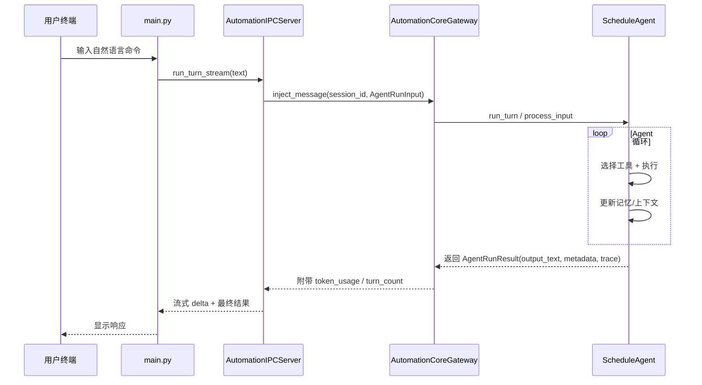

# Schedule Agent 架构总览

## 1. 系统目标与边界

- **核心目标**：提供一个基于 LLM 的「工具驱动日程助手」，支持自然语言管理日程 / 任务，并通过自动化能力在后台持续执行规划与同步。
- **主要能力边界**：
  - 交互侧：CLI（已实现）、本地/远程 Web 前端（见 `WEB_ARCHITECTURE.md` 规划）。
  - 计算侧：单一 **ScheduleAgent** 核心，统一负责意图解析、工具调用与记忆管理。
  - 自动化侧：独立的 **automation daemon** 进程负责定时任务、队列消费和会话过期管理。
  - 存储侧：以本地 JSON 为主（事件/任务/自动化任务等），后续可替换为数据库实现。

## 2. 顶层架构概览

整体可以分为四层：

```text
┌───────────────────────────────────────────────┐
│               交互层 Frontends               │
│  - CLI (main.py)                             │
│  - Web 前端 (Chat UI / Calendar / Tasks)     │
└───────────────────────────────┬──────────────┘
                                │
┌───────────────────────────────▼──────────────┐
│        接入层 & 进程间通信 API Layer         │
│  - automation_daemon.py                      │
│  - AutomationIPCServer / AutomationIPCClient │
│  - Web API (FastAPI, 规划中)                 │
└───────────────────────────────┬──────────────┘
                                │
┌───────────────────────────────▼──────────────┐
│              Agent 核心层 Core               │
│  - ScheduleAgent (core/agent)                │
│  - LLMClient (core/llm)                      │
│  - Tool Registry & Working Set               │
│  - Conversation / Time Context               │
│  - Memory System (4 层记忆)                  │
└───────────────────────────────┬──────────────┘
                                │
┌───────────────────────────────▼──────────────┐
│        工具与数据层 Tools & Storage          │
│  - core/tools/* (日程、文件、终端、记忆等)   │
│  - automation/connectors/* (Canvas/Email 等) │
│  - storage/json_repository.py                │
│  - data/*.json / MEMORY.md / 内容存储        │
└───────────────────────────────────────────────┘
```

更细的 Web 与 Automation 子架构分别见：

- `docs/WEB_ARCHITECTURE.md`
- `docs/AUTOMATION_ARCHITECTURE.md`

## 3. 核心组件与职责

### 3.1 交互层

- **CLI (`main.py`)**
  - 解析命令行参数 / 单条自然语言指令。
  - 加载配置 `Config` 与默认工具集合 `get_default_tools(config)`。
  - 根据环境变量 `SCHEDULE_AUTOMATION_IPC` 决定模式：
    - 优先通过 **AutomationIPCClient** 连接常驻 daemon。
    - 若 IPC 不可用，在本进程内直接构建 `ScheduleAgent` 进入交互循环。

- **Web 前端（规划中）**
  - 通过 WebSocket / REST API 与后端交互，见 `WEB_ARCHITECTURE.md`。
  - Web 层只关心「会话 ID + 文本消息 + 流式响应」，不直接接触工具细节。

### 3.2 Automation Daemon

- 文件：`automation_daemon.py`，详见 `AUTOMATION_ARCHITECTURE.md`。
- 职责：
  - 作为长期运行进程，统一承载：
    - 调度器 `AutomationScheduler`（按配置触发自动化 Job）。
    - 队列 `AgentTaskQueue` + 消费循环 `_consume_loop`。
    - IPC Server `AutomationIPCServer`（Unix Socket）。
  - 使用 `SessionManager` 为自动化任务维护独立的 `ScheduleAgent` 会话。
  - 通过 `AutomationCoreGateway` 暴露多会话管理能力（列表、切换、过期策略等）。
  - 周期性执行会话过期检查（idle 时间 + 每日 4 点切分），并触发总结与重置。

### 3.3 ScheduleAgent 核心

- 文件：`core/agent/agent.py`。
- 主要职责：
  - 管理一次对话 / 任务执行过程中的 **LLM 调用 + 工具调用循环**。
  - 构建系统提示词（包含时间上下文、角色设定、tool schema 等）。
  - 维护多轮对话上下文 `ConversationContext`，并结合记忆策略裁剪历史。
  - 通过 `ToolWorkingSetManager` 控制每轮暴露给 LLM 的工具集合（pinned + LRU 工作集）。
  - 接入 MCP 客户端，为 Agent 提供联网搜索 / 外部工具调用能力。

### 3.4 LLM 客户端

- 文件：`core/llm/client.py`。
- 特点：
  - 统一封装 OpenAI 兼容协议（豆包 / Qwen / 其他兼容端点）。
  - 暴露 `LLMResponse` 抽象（content + tool_calls + usage），隐藏底层差异。
  - 支持：
    - 普通对话 `chat`。
    - 多模态识图 `chat_with_image`。
    - 带工具的 Function Calling（含流式 `_chat_with_tools_stream`）。
  - 对 Qwen 深度思考模式自动剥离 `<think>...</think>`，仅将正式回复交给上层。

### 3.5 记忆系统

- 配置：`Config.memory` + `MEMORY.md`。
- 四层记忆：
  - **WorkingMemory**：当前工作记忆，基于 token 阈值自动总结。
  - **ShortTermMemory**：短期检索记忆，支持按相似度召回最近对话片段。
  - **LongTermMemory**：长期偏好与知识，存放于 `MEMORY.md` + 各种向量化索引。
  - **ContentMemory**：文件 / 笔记 / 媒体内容的索引（如 `data/memory/content/...`）。
- 所有物理路径通过 `_resolve_memory_owner_paths` 按 `user_id` 命名空间隔离：
  - 不同终端/来源共享同一用户的记忆。
  - `MEMORY.md` 目前仍是全局单一文件，避免多份长期偏好副本。

### 3.6 工具系统

- 文件：`core/tools/*`。
- 抽象：
  - 所有业务能力均以 `BaseTool` 子类形式存在，通过 `VersionedToolRegistry` 统一注册。
  - `ToolWorkingSetManager` 根据使用频率维护 LRU 工作集，避免一次暴露过多工具。
- 主要类别示例：
  - 日程与任务：`AddEventTool`、`GetEventsTool`、`PlanTasksTool` 等。
  - 文件与命令：`ReadFileTool`、`WriteFileTool`、`ModifyFileTool`、`RunCommandTool`。
  - 记忆工具：`MemorySearchLongTermTool`、`MemorySearchContentTool`、`MemoryStoreTool` 等。
  - 自动化工具：`ConfigureAutomationPolicyTool`、`GetAutomationActivityTool`、`CreateScheduledJobTool`。
  - 多模态与 Canvas：`AttachMediaTool`、`SyncCanvasTool`、Canvas 集成工具。
  - 联网/MCP 工具：`WebSearchTool`、`WebExtractorTool`、MCP Proxy 等。

## 4. 关键运行链路

### 4.1 CLI → Automation Daemon → ScheduleAgent



### 4.2 Automation 任务执行

- 自动化任务定义（如 `summary.daily`、`sync.course` 等）持久化在本地存储中。
- `AutomationScheduler` 根据配置周期性扫描并将需要执行的任务写入 `AgentTaskQueue`。
- `_consume_loop` 从队列中取出任务：
  - 通过 `SessionManager` 获取或创建对应会话的 `ScheduleAgent`。
  - 构造自然语言指令 `instruction` 调用 Agent，记录 trace 与结果。
  - 结合 `AutomationTaskLogger` 校验「必要操作是否完成」，更新任务状态。

## 5. 数据与配置

- **数据存储**
  - 事件 / 任务：`data/events.json` / `data/tasks.json`（通过 `json_repository` 读写）。
  - 自动化任务定义与执行记录：`automation/repositories.py` 管理的 JSON 存储。
  - 会话与记忆：`data/memory/*`、`logs/sessions/*.jsonl` 等。

- **配置系统**
  - 主配置文件：`config.yaml`（参考 `config.example.yaml`）。
  - 通过 `agent.config.Config` 强类型化，并在 `ScheduleAgent`、automation daemon、CLI 中广泛使用。
  - 关键领域：
    - `llm.*`：模型、密钥、请求超时、温度、token 限制。
    - `time.*`：默认时区，用于 `TimeContext`。
    - `memory.*`：工作记忆阈值、召回策略、目录路径。
    - `automation.*`：自动化 Job、调度策略、会话过期策略。
    - `mcp.*`：MCP servers 与远程工具配置。

## 6. 与子架构文档的关系

- 本文档聚焦 **整体系统架构** 与各模块职责。
- Web 相关细节（前端模块划分、WebSocket/REST API 设计、会话管理）见：`WEB_ARCHITECTURE.md` 与 `WEB_ARCHITECTURE_DIAGRAM.md`。
- Automation 相关细节（调度器、队列、IPC、会话过期策略）见：`AUTOMATION_ARCHITECTURE.md`。

