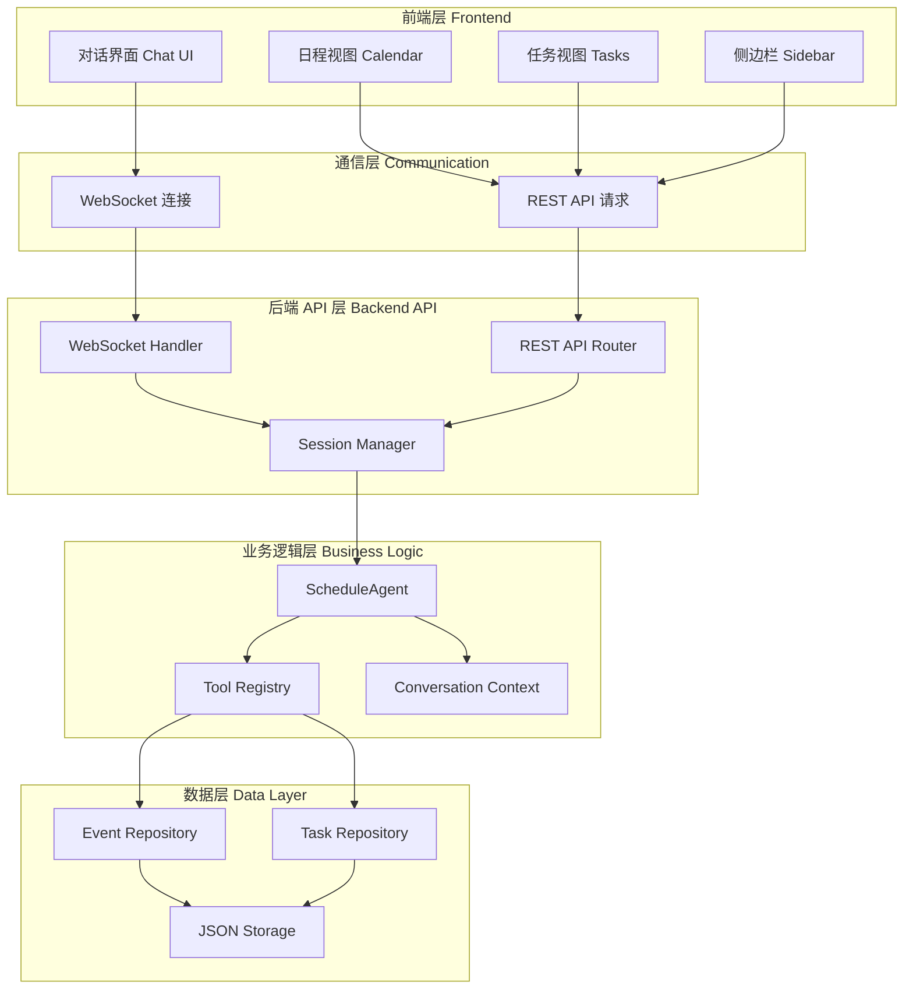
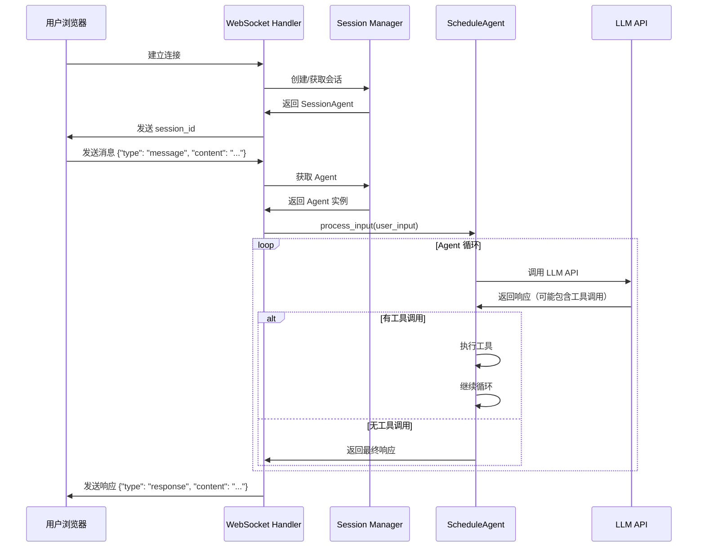
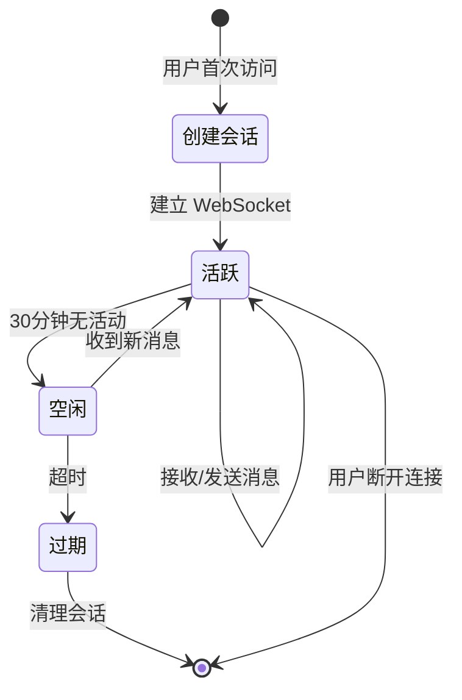
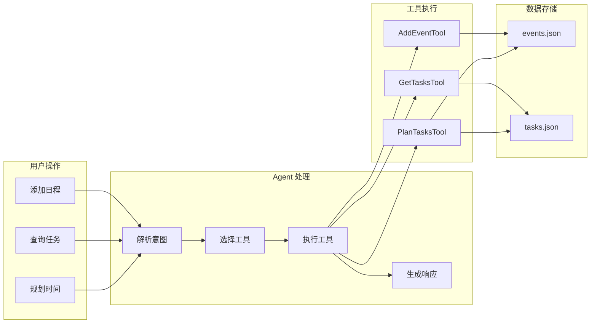
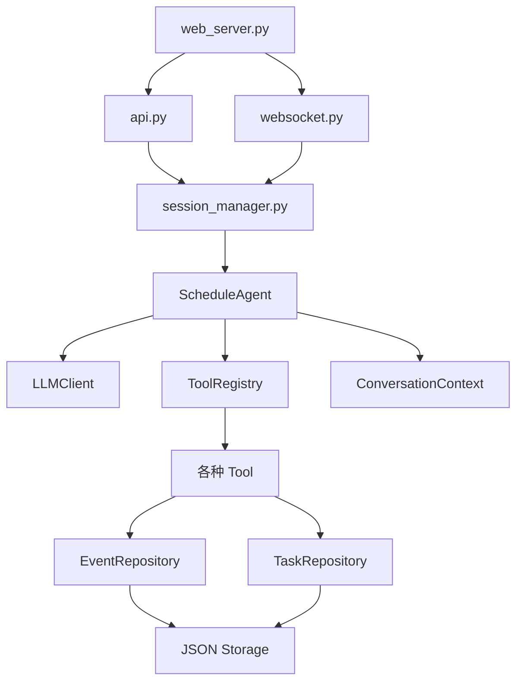

# Schedule Agent Web 架构图

## 系统架构流程图

```mermaid
graph TB
    subgraph "前端层 Frontend"
        A[对话界面 Chat UI]
        B[日程视图 Calendar]
        C[任务视图 Tasks]
        D[侧边栏 Sidebar]
    end
    
    subgraph "通信层 Communication"
        E[WebSocket 连接]
        F[REST API 请求]
    end
    
    subgraph "后端 API 层 Backend API"
        G[WebSocket Handler]
        H[REST API Router]
        I[Session Manager]
    end
    
    subgraph "业务逻辑层 Business Logic"
        J[ScheduleAgent]
        K[Tool Registry]
        L[Conversation Context]
    end
    
    subgraph "数据层 Data Layer"
        M[Event Repository]
        N[Task Repository]
        O[JSON Storage]
    end
    
    A --> E
    B --> F
    C --> F
    D --> F
    
    E --> G
    F --> H
    
    G --> I
    H --> I
    
    I --> J
    J --> K
    J --> L
    
    K --> M
    K --> N
    M --> O
    N --> O
```

## WebSocket 消息流

```mermaid
sequenceDiagram
    participant U as 用户浏览器
    participant WS as WebSocket Handler
    participant SM as Session Manager
    participant SA as ScheduleAgent
    participant LLM as LLM API
    
    U->>WS: 建立连接
    WS->>SM: 创建/获取会话
    SM->>WS: 返回 SessionAgent
    WS->>U: 发送 session_id
    
    U->>WS: 发送消息 {"type": "message", "content": "..."}
    WS->>SM: 获取 Agent
    SM->>WS: 返回 Agent 实例
    WS->>SA: process_input(user_input)
    
    loop Agent 循环
        SA->>LLM: 调用 LLM API
        LLM->>SA: 返回响应（可能包含工具调用）
        
        alt 有工具调用
            SA->>SA: 执行工具
            SA->>SA: 继续循环
        else 无工具调用
            SA->>WS: 返回最终响应
        end
    end
    
    WS->>U: 发送响应 {"type": "response", "content": "..."}
```

## 会话生命周期

```mermaid
stateDiagram-v2
    [*] --> 创建会话: 用户首次访问
    创建会话 --> 活跃: 建立 WebSocket
    活跃 --> 活跃: 接收/发送消息
    活跃 --> 空闲: 30分钟无活动
    空闲 --> 活跃: 收到新消息
    空闲 --> 过期: 超时
    过期 --> [*]: 清理会话
    活跃 --> [*]: 用户断开连接
```

## 数据流图

```mermaid
flowchart LR
    subgraph "用户操作"
        A1[添加日程]
        A2[查询任务]
        A3[规划时间]
    end
    
    subgraph "Agent 处理"
        B1[解析意图]
        B2[选择工具]
        B3[执行工具]
        B4[生成响应]
    end
    
    subgraph "工具执行"
        C1[AddEventTool]
        C2[GetTasksTool]
        C3[PlanTasksTool]
    end
    
    subgraph "数据存储"
        D1[events.json]
        D2[tasks.json]
    end
    
    A1 --> B1
    A2 --> B1
    A3 --> B1
    
    B1 --> B2
    B2 --> B3
    B3 --> B4
    
    B3 --> C1
    B3 --> C2
    B3 --> C3
    
    C1 --> D1
    C2 --> D2
    C3 --> D1
    C3 --> D2
```

## 组件依赖关系

```mermaid
graph TD
    A[web_server.py] --> B[api.py]
    A --> C[websocket.py]
    B --> D[session_manager.py]
    C --> D
    D --> E[ScheduleAgent]
    E --> F[LLMClient]
    E --> G[ToolRegistry]
    E --> H[ConversationContext]
    G --> I[各种 Tool]
    I --> J[EventRepository]
    I --> K[TaskRepository]
    J --> L[JSON Storage]
    K --> L
```
